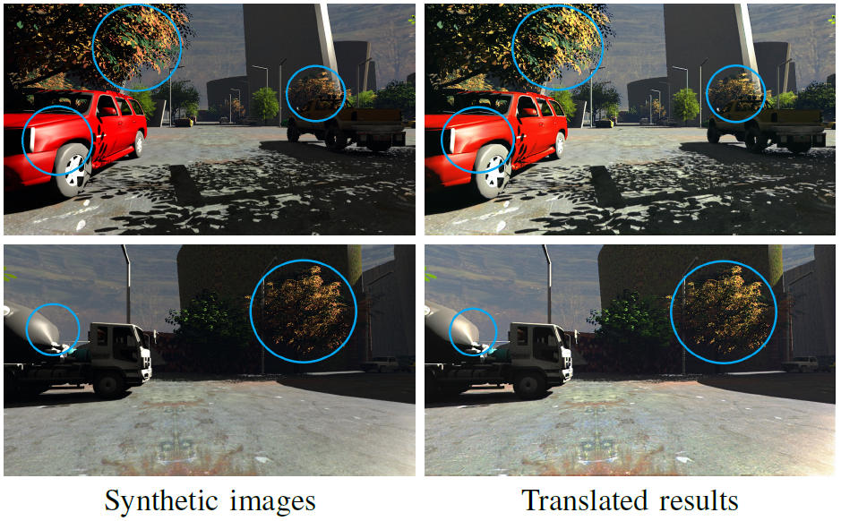
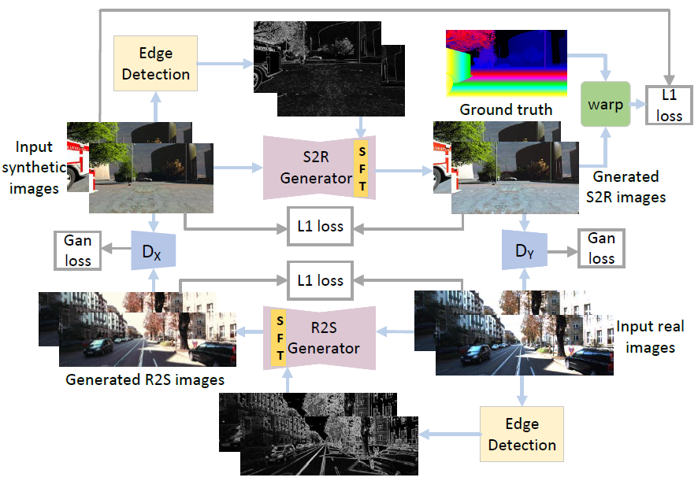

# SDA_network
This is the implementation of the paper **Synthetic-to-real domain adaptation joint spatial feature transform for stereo matching**, Xing Li, Yangyu Fan, Zhibo Rao, Guoyun Lv, and Shiya Liu.
The code was written by Xing Li and Zhibo Rao.  

We propose a new method that translates the style of synthetic domain dataset to the real domain but maintains content and spatial information. The visual results are as follows.  
  
**Synthetic-to-real domain translated results.** Blue circles emphasize the difference between the synthetic and translated images, including overall tone (blue sky), local color (the leaves), and sunlight reflection (the illuminate direction).  

<br />
**The architecture of our proposed SDA network.** The core of our approach is to 1) compel the generated images to preserve content and spatial information with inputs, 2) prevent generated stereo left-right pairs mismatch. For this purpose, we leverage cues for edge features through a spatial feature transform layer to enforce spatial consistency between stereo images. Furthermore, we adopt the warp loss to encourage the warpped left image approach to the original left image.

## Result Videos
  
    
**The architecture of our proposed SDA network.**
**Left: Original SceneFlow. Right: SDA-Net generated Translated SceneFlow.** Resolution: 960x574     

  
**Left: Disparity estimation results of Abc-Net that trained on the translated SceneFlow.** **Right: Disparity error.** Resolution: 960x574    

## Software Environment
1. OS Environment  
    os == windows 10  
    cudaToolKit == 10.0  
    cudnn == 7.6.5  
2. Python Environment  
    python == 3.7.9  
    tensorflow == 1.15.0  
    numpy == 1.19.2  
    opencv-python == 4.5.1.48  
    pillow == 8.1.0  
## Data Preparation
Download [Scene Flow Datasets](https://lmb.informatik.uni-freiburg.de/resources/datasets/SceneFlowDatasets.en.html), [Synthia](https://synthia-dataset.net/downloads/), [KITTI 2012](http://www.cvlibs.net/datasets/kitti/eval_stereo_flow.php?benchmark=stereo), [KITTI 2015](http://www.cvlibs.net/datasets/kitti/eval_scene_flow.php?benchmark=stereo)

## Training:

Run the TrainSDANet.sh
```
$ sh TrainSDANet.sh
```

## Testing:

Run the TestSDANet.sh
```
$ sh TestSDANet.sh
```

## File Structure
```
.                          
├── Source # source code                 
│   ├── Basic       
│   ├── Evaluation       
│   └── ...                
├── Dataset # Get it by ./Source/Tools/GenPath.sh, you need build folder                   
│   ├── trainlist.txt   
│   ├── labellist.txt   
│   └── ...                
├── Result # The data of Project. Auto Bulid                   
│   ├── output.log   
│   ├── train_acc.csv   
│   └── ...       
├── ResultImg # The image of Result. Auto Bulid                   
│   ├── 000001_10.png   
│   ├── 000002_10.png   
│   └── ...       
├── PAModel # The saved model. Auto Bulid                   
│   ├── checkpoint   
│   └── ...   
├── log # The graph of model. Auto Bulid                   
│   ├── events.out.tfevents.1605153366.DESKTOP-GHD7UKT       
│   └── ...       
├── TrainSDANet.sh
├── TestSDANet.sh  
├── LICENSE
├── requirements.txt
└── README.md               
```
